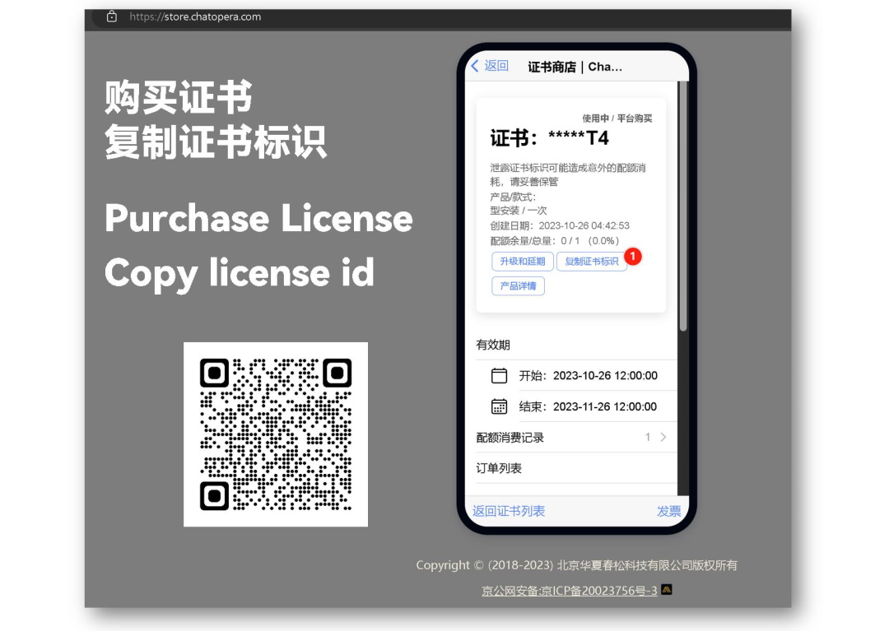

# 春松客服大讲堂

😉 春松客服大讲堂，面向开发者、软件工程师及运维人员的在线课程（视频及课件）。

* 基于春松客服定制客服系统，紧紧围绕春松客服开发技能
* 由浅入深的介绍春松客服上线智能客服系统、运营客服工作
* 全面介绍春松客服插件、机器人客服的等原理和使用

## 购买地址

春松客服大讲堂通过 Chatopera 证书商店进行出售，通过购买的【证书标识】获得下载 URL 地址，或扫下图二维码。

[https://store.chatopera.com/product/cskfdjt19](https://store.chatopera.com/product/cskfdjt19)




## 课程大纲

共 7 章，合计 21 学时视频，552 页 PPT 课件。

<table>
  <tr>
    <th>章</th>
    <th>小节</th>
    <th>时长（时:分:秒）</th>
  </tr>
  <tr>
    <td rowspan="3">一、春松客服的介绍</td>
    <td>如何使用Java开发智能客服系统</td>
    <td>00:31:55</td>
  </tr>
  <tr>
    <td>春松客服在企业的落地</td>
    <td>00:25:23</td>
  </tr>
  <tr>
    <td>春松客服的技术介绍</td>
    <td>01:01:30</td>
  </tr>
  <tr>
    <td rowspan="7">二、客服相关的基本知识</td>
    <td>客服的日常工作</td>
    <td>00:52:44</td>
  </tr>
  <tr>
    <td>客服的基本知识</td>
    <td>00:41:40</td>
  </tr>
  <tr>
    <td>账号体系-权限，部门和角色</td>
    <td>00:38:42</td>
  </tr>
  <tr>
    <td>坐席会话的工具-拉黑，服务小结和转接</td>
    <td>00:32:16</td>
  </tr>
  <tr>
    <td>即时通信及坐席自动分配</td>
    <td>00:49:59</td>
  </tr>
  <tr>
    <td>企业聊天与人工质检</td>
    <td>00:31:16</td>
  </tr>
  <tr>
    <td>统计报表和满意度评价</td>
    <td>00:36:59</td>
  </tr>
  <tr>
    <td rowspan="6">三、春松客服的上线及维护</td>
    <td>春松客服的编译和部署</td>
    <td>00:37:28</td>
  </tr>
  <tr>
    <td>春松客服的运维管理</td>
    <td>00:59:26</td>
  </tr>
  <tr>
    <td>春松客服的自动化系统测试（1）</td>
    <td>00:31:28</td>
  </tr>
  <tr>
    <td>春松客服的自动化系统测试（2）</td>
    <td>00:48:43</td>
  </tr>
  <tr>
    <td>春松客服的压力测试（1）</td>
    <td>00:31:52</td>
  </tr>
  <tr>
    <td>春松客服的压力测试（2）</td>
    <td>00:39:36</td>
  </tr>
  <tr>
    <td rowspan="3">四、春松客服的机器人客服</td>
    <td>Chatopera 云服务介绍</td>
    <td>00:26:23</td>
  </tr>
  <tr>
    <td>机器人的知识库管理</td>
    <td>00:38:27</td>
  </tr>
  <tr>
    <td>机器人的多轮对话及富文本消息类型</td>
    <td>00:35:08</td>
  </tr>
  <tr>
    <td rowspan="8">五、春松客服开发基础知识</td>
    <td>SQL快速入门</td>
    <td>00:38:38</td>
  </tr>
  <tr>
    <td>春松客服数据库表及管理</td>
    <td>00:41:44</td>
  </tr>
  <tr>
    <td>Java编程基础（1）</td>
    <td>00:36:12</td>
  </tr>
  <tr>
    <td>Java编程基础（2）</td>
    <td>01:34:23</td>
  </tr>
  <tr>
    <td>Maven项目管理</td>
    <td>00:39:56</td>
  </tr>
  <tr>
    <td>搭建春松客服开发环境</td>
    <td>01:10:28</td>
  </tr>
  <tr>
    <td>SpringBoot快速入门</td>
    <td>00:38:46</td>
  </tr>
  <tr>
    <td>项目源码讲解</td>
    <td>01:07:21</td>
  </tr>
  <tr>
    <td rowspan="2">六、春松客服的插件</td>
    <td>插件机制设计</td>
    <td>00:36:21</td>
  </tr>
  <tr>
    <td>春松客服机器人插件解读</td>
    <td>00:37:59</td>
  </tr>
  <tr>
    <td>七、总结</td>
    <td>春松客服团队介绍及课程总结</td>
    <td>00:30:08</td>
  </tr>
</table>

## 下载课程文件

在 [Chatopera 证书商店](https://store.chatopera.com/product/cskfdjt19) 获得到证书 ID（`LICENSE_ID`） 后，文件的下载地址为：

https://store.chatopera.com/dl/${LICENSE_ID}.gz


将 `${LICENSE_ID}` 替换为您的证书标识。假设上一步得到的证书标识为：`L123`，那么 URL 下载地址就是：

https://store.chatopera.com/dl/L123.gz


**将您的课程文件的 URL 下载地址在浏览器中打开，完成下载，文件大小约 3.5 GB。您也可以使用 `wget` 命令行工具从命令行终端（比如 Bash Shell）下载和解压。**

```
wget --no-check-certificate https://store.chatopera.com/dl/L123.gz -O cskfdjt.tar.gz
tar xzfv cskfdjt.tar.gz # 进行解压
```


## 春松客服：做好开源客服系统

春松客服是开源客服系统，首个版本发布于 2018 年，截至 2023 年，以 GitHub Star, Issues 反馈等衡量，是目前最流行的中文开源客服系统。春松客服包含多个开箱即用的模块：

* 账号及组织机构管理：按组织、角色分配账号权限
* 坐席监控：设置坐席监控角色的人员可以看到并干预访客会话
* 联系人和客户管理：CRM 模块，管理联系人和客户，细粒度维护客户信息，自定义标签和打标签，记录来往历史等
* 网页渠道组件：一分钟接入对话窗口，支持技能组、邀请和关联联系人等
* Facebook 渠道组件：快速接入 Facebook Messenger 渠道，通过 Messenger 支持 Facebook 粉丝页、Shopify 等海外社交、电商平台
* 坐席工作台：汇聚多渠道访客请求，坐席根据策略自动分配，自动弹屏，转接等
* 机器人客服：与Chatopera 云服务集成
* 企业聊天：支持企业员工在春松客服系统中群聊和私聊
* 质检：历史会话、服务小结、服务反馈及相关报表

春松客服官网：https://www.cskefu.com

春松客服的源代码：[GitHub](https://github.com/cskefu/cskefu) | [Gitee](https://gitee.com/cskefu/cskefu)

